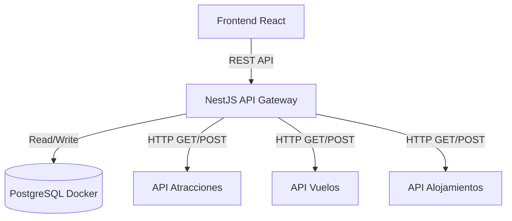

# Technical Requirements — Booking Prototipo

## System Overview

El sistema actuará como el núcleo integrador (Marketplace + Admin) conectando sistemas heterogéneos de estudiantes. 
The runtime is **Node.js (Backend)** y **Navegador Web (Frontend)**. The system MUST remain fully functional within these constraints.

---

## System Architecture

### Layered Architecture



### Layer Responsibilities

**Frontend (React):**
- UI Marketplace (Plantilla Booking.com).
- Consumo exclusivo de los endpoints de nuestro NestJS (BFF - Backend For Frontend).

**Backend (NestJS):**
- Actúa como Integrador.
- Expone endpoints unificados al Frontend.
- Orquesta llamadas HTTP hacia las APIs de los compañeros (ej. `AtraccionesService` hace peticiones al exterior).
- Gestiona la lógica transaccional de Carritos y Facturas.

**Base de Datos (Docker PostgreSQL):**
- Almacena únicamente las 8 tablas core de administración y ventas (`usuarios`, `carritos`, `facturas`, `logs`, etc.).
- Debe construirse vía TypeORM (`synchronize: true` en Reto 1) para facilitar el despliegue local de Alejo, Lizz y tú.

---

## Component Architecture

### Directory Structure

```
/
├── frontend/                # Aplicación React
├── backend/                 # Aplicación NestJS
│   ├── src/
│   │   ├── modulos_core/    # Usuarios, Carritos, Facturas
│   │   ├── integraciones/   # Atracciones, Vuelos, Alojamientos
│   │   └── config/          # Base de datos, HTTP
├── docker-compose.yml       # BD PostgreSQL
└── docs Paúl Rosero/        # Documentación de Arquitectura y Memoria AI
```

---

## Data and Persistence

Se utiliza **PostgreSQL 15+** en un contenedor Docker.
La persistencia está limitada a transacciones (facturas) y carritos. El estado de los productos (ej. "Cupos disponibles en atracción") no se persiste aquí, se lee en vivo de las APIs externas.

---

## Performance Requirements

- **Integración:** Las llamadas a las APIs externas no deben bloquear el hilo principal. Usar RxJS u observables provistos por `@nestjs/axios`.
- **Resiliencia (Reto 2/3):** Implementar Timeout y manejo de errores (Try/Catch) por si la API del compañero se cae, para no tumbar nuestro frontend.

---

## Version and Tooling Requirements

| Component | Version / Standard |
|---|---|
| Backend | NestJS 10.x |
| Frontend | React 18+ (Vite) |
| Database | PostgreSQL 15 (Docker) |
| ORM | TypeORM |
| HTTP Client | Axios / @nestjs/axios |

### Quality Gates

- Documentación Swagger/OpenAPI obligatoria para el backend (requisito del proyecto).
- Despliegue funcional en Internet para cada hito.
- Arquitectura API-first documentada antes de programar.
