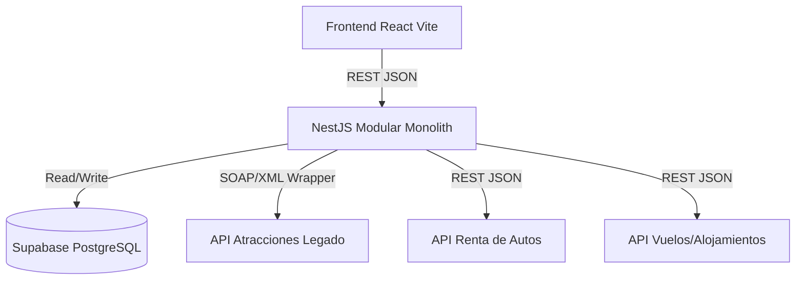

# Technical Requirements — Booking Prototipo

## System Overview

El sistema actuará como el núcleo integrador (Marketplace + Admin) conectando sistemas heterogéneos de estudiantes. 
The runtime is **Node.js (Backend)** y **Navegador Web (Frontend)**. The system MUST remain fully functional within these constraints.

---

## System Architecture

### Layered Architecture


```mermaid
graph TD
    UI[Frontend React Vite] --> |REST JSON| API[NestJS Modular Monolith]
    API --> |Read/Write| DB[(Supabase PostgreSQL)]
    API --> |SOAP/XML Wrapper| ExtAPI1[API Atracciones Legado]
    API --> |REST JSON| ExtAPI2[API Renta de Autos]
    API --> |REST JSON| ExtAPI3[API Vuelos/Alojamientos]
```

### Layer Responsibilities

**Frontend (React):**
- UI Marketplace (Plantilla Booking.com).
- Consumo exclusivo de los endpoints de nuestro NestJS (BFF - Backend For Frontend).

**Backend (NestJS Monolito Modular):**
- Actúa como Integrador Principal nivel 3 de Richardson (HATEOAS).
- Expone endpoints unificados al Frontend manejando errores estándar RFC7807.
- Orquesta integraciones complejas: 
  - **Atracciones:** Traduce al vuelo peticiones JSON a XML para un sistema SOAP de legado.
  - **Autos:** Consume catálogo y disponibilidad vehicular vía REST nativo.
- Gestiona la lógica transaccional de Carritos, Facturas y control de bloqueos de tarifas.

**Base de Datos (Supabase PostgreSQL):**
- Almacena únicamente las 8 tablas core de administración y ventas (`usuarios`, `carritos`, `facturas`, `logs`, etc.).
- Debe construirse vía TypeORM (`synchronize: true` en Reto 1) conectado a la base de datos cloud de Supabase para facilitar la integración.

---

## Component Architecture

### Directory Structure

```
/
├── frontend/                # Aplicación React Vite (Clon Booking.com)
├── api/                     # Aplicación NestJS (Modular Monolith)
│   ├── src/
│   │   ├── modules/
│   │   │   ├── atracciones/ # Integración SOAP (Wrapper Service)
│   │   │   ├── autos/       # Integración REST de Alquiler de Vehículos
│   │   │   ├── vuelos/      # (Stub/Mocking fallback)
│   │   │   └── alojamientos/# (Stub/Mocking fallback)
│   │   ├── core/            # Interceptors (HATEOAS), Filters (RFC7807)
│   │   └── common/          # Configuración y utilidades compartidas
└── docs Paúl Rosero/        # Documentación de Arquitectura y Memoria AI
```

---

## Data and Persistence

Se utiliza **PostgreSQL 15+** hosteado en **Supabase**.
La persistencia está limitada a transacciones (facturas) y carritos. El estado de los productos (ej. "Cupos disponibles en atracción") no se persiste aquí, se lee en vivo de las APIs externas.

---

## Performance Requirements

- **Integración:** Las llamadas a las APIs externas no deben bloquear el hilo principal. Usar RxJS u observables provistos por `@nestjs/axios`.
- **Resiliencia (Reto 2/3):** Implementar Timeout y manejo de errores (Try/Catch) por si la API del compañero se cae, para no tumbar nuestro frontend.

---

## Version and Tooling Requirements

| Component | Version / Standard |
|---|---|
| Backend | NestJS 10.x |
| Frontend | React 18+ (Vite) |
| Database | Supabase PostgreSQL |
| ORM | TypeORM |
| HTTP Client | Axios / @nestjs/axios |

### Quality Gates

- Documentación Swagger/OpenAPI obligatoria para el backend (requisito del proyecto).
- Despliegue funcional en Internet para cada hito.
- Arquitectura API-first documentada antes de programar.
